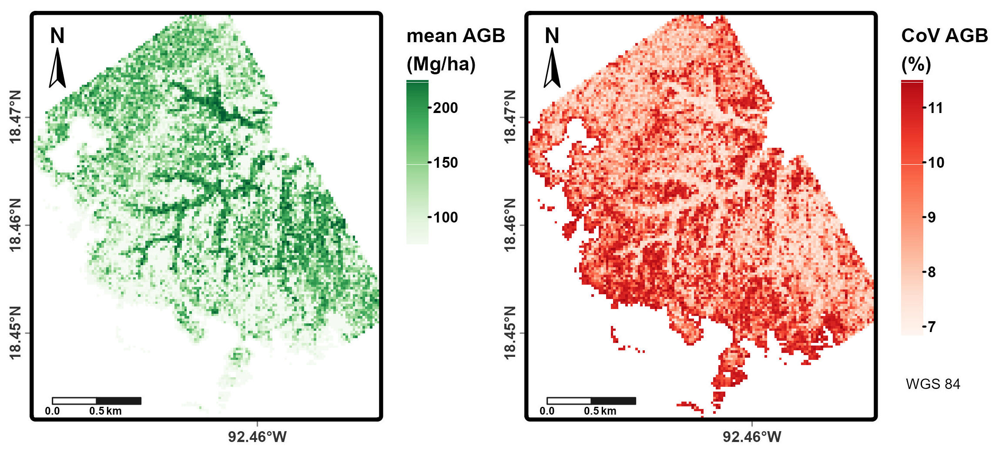

# AGBLiDAR

This repo contains the scripts to model AGB using LiDAR data and the files to build the article reporting the findings (including the manuscript, maps, and figures). Everything was performed in R.

The complete article can be consulted here: [Mapping Tropical Forested Wetlands Biomass with LiDAR: A Machine Learning Comparison](https://doi.org/10.3390/rs17061076)

The repo contains three main folders: 

## 1. Scripts

This folder contains all the processing steps:

1. AGB_calc. Calculates AGB for each plot using BIOMASS package. This step includes searching for each specie's wood density in Zanne et al., 2009 and calculating AGB uncertainty.

2. AnalisislidR. Calculates LiDAR cloud point metrics using lidR package. This step includes creating a DTM from the cloud, normalize non-ground points and extract vertical profiles (Z) and intensity (I) metrics.

3. Fitting different models: 
	3.1. LM_models. Linear models.
	3.2. RF_models. Random forest models.
	3.3. XGB_modeks. XGBoost models.

4. CI_int_pred. Calculates de confidence intervals for the predictions made by the best model. This calculation is performed using a bootstrapped dataset.

5. AnalisislidR_AllROI. Calculates the three LiDAR metrics included in the best model in a raster with a pixel resolution of 25 m.

6. ROIAGB_pred. Makes the AGB prediction for the complete study area. This prediction is done based on the best model and using the LiDAR metrics generated for the complete study area (step 5).

7. Map. Create maps of the study site and AGB prediction for the complete study area.

## 2. Manuscript

This folder contains all the files required to make a word document of the article, using RMarkdown and RStudio.

1. The main document is Manuscript_LiDARAGBCometa which contains the text and code for some figures and tables. 

2. Library. Contains the bib library that is cited in the manuscript.

3. Template. Contains the template for the styles used to render the Word document.

4. remote-sensing. It is the file that indicates how the references should be formatted.

5. Trackdown script to update files in Google Drive. This is a package that allows uploading an md and docx documents to drive.

## 3. Data

1. BD_Joni_lidR_24. Contains the AGB data used in this study.

A preview of the final predictions:

